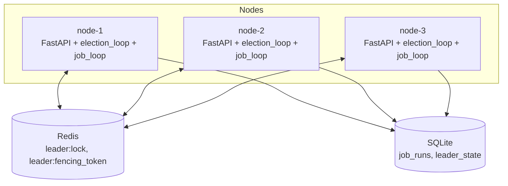

# Distributed Task Scheduler

A highly-available task scheduler that runs across multiple nodes but guarantees only
one node ever acts as leader at a time — using Redis-based lease election, atomic
compare-and-set renewal, and fencing tokens to prevent split-brain and stale-leader
writes. Built from scratch (no Celery Beat, no ZooKeeper, no off-the-shelf election
library) to understand the actual mechanics of distributed coordination.

## What it does

- 3 identical node processes compete for leadership via a Redis lease.
- Only the current leader executes the scheduled job.
- If the leader dies, a follower automatically takes over within seconds — no human
  intervention.
- Fencing tokens protect against a paused/stale leader waking up and writing anyway,
  even after it has lost the lease.
- Every node exposes a live `/status` endpoint showing its role, current leader, and
  lease TTL.

## Architecture



- **Redis** holds the lease (`leader:lock`, TTL-based) and issues a strictly
  increasing fencing token on every successful acquisition.
- **SQLite** (shared volume across all node containers) is where the actual
  enforcement happens — every job write is checked against the highest fencing
  token ever accepted, in the same transaction as the write itself.

## How leader election works

1. **Acquire**: `SET leader:lock <node_id> NX EX <ttl>` — atomic, only one node can
   win. A combined Lua script issues a fencing token (`INCR`) in the same atomic step
   as acquisition.
2. **Renew**: every `RENEW_INTERVAL_SECONDS` (~ttl/3), the current leader renews its
   lease via a Lua compare-and-set script — it only extends the TTL if the stored
   value still matches its own `node_id`, preventing a node from ever renewing a
   lease it no longer holds.
3. **Failover**: `election_loop()` always attempts `renew()` first; if that fails
   (not leader, or lease expired), it falls back to `try_acquire()`. No node ever
   checks "am I leader" before acting — it just attempts the atomic operation and
   lets Redis decide. This avoids check-then-act races entirely.
4. **Fencing**: every job write includes the writer's fencing token. If the token is
   lower than the highest one ever accepted, the write is rejected — this protects
   against a leader that paused long enough to lose its lease, then resumed still
   believing it was leader.

## Running it

**Requirements**: Docker + Docker Compose.

```bash
docker compose up --build
```

This starts 3 scheduler nodes (`localhost:8001`, `8002`, `8003`) and one Redis
instance, all sharing one SQLite database via a named volume.

Check status of any node:
```bash
curl localhost:8001/status
curl localhost:8002/status
curl localhost:8003/status
```

## Demo: watch failover happen live

1. Find the current leader:
   ```bash
   curl localhost:8001/status | grep current_leader
   ```
2. Kill its container (say it's node-2):
   ```bash
   docker kill distributed-task-scheduler-node-2-1
   ```
3. Poll a surviving node every second or two:
   ```bash
   while true; do curl -s localhost:8001/status; echo; sleep 1; done
   ```
4. Within a few seconds, a different node's `role` will flip to `"leader"`, and its
   `current_token` will be a new, higher fencing token than the one the dead leader
   held — proving the handoff was clean, not duplicated.

Measured in testing: failover consistently completes in **5-15 seconds**
(bounded by `LEASE_TTL_SECONDS` + `RENEW_INTERVAL_SECONDS`).

**Important**: always run `docker compose down -v` (not just `down`) between test
runs. `-v` removes the named volume; without it, stale Redis/SQLite state from a
previous run persists and will produce confusing results (see Known Limitations).

## Known limitations

These are deliberate, understood tradeoffs — not oversights.

- **In-memory fencing token doesn't survive a process restart.** A node's
  `self.current_token` lives in memory. If a node restarts while its lease is still
  technically valid under the same `NODE_ID`, it will correctly report
  `role: "leader"` (Redis confirms it) but `current_token: null` until it next
  successfully renews/re-acquires. Hit this exact scenario during testing — see
  commit history for the debugging trail.
- **Failure detection has a fundamental floor.** Any lease-based system has a
  detection lag bounded by the TTL — a job "due" right when the leader dies can be
  delayed by up to `LEASE_TTL_SECONDS + RENEW_INTERVAL_SECONDS` before a new leader
  picks it up. This is a liveness tradeoff, not a bug: smaller TTLs detect failure
  faster but risk a healthy node losing leadership from one missed network tick.
- **SQLite + shared volume only works because all nodes run on one Docker host.**
  This setup would not work across physically separate machines — SQLite assumes a
  single shared filesystem. A real multi-machine deployment would use a proper
  network-accessible database (Postgres) instead.
- **Redis is itself a single point of failure** in this setup. A production version
  would run Redis Sentinel or a Redis Cluster rather than one instance.
- **Lease-based locks have known correctness caveats under clock drift / GC-style
  pauses** (see Martin Kleppmann's critique of Redlock). Fencing tokens close the
  gap for the write path specifically, but the underlying assumption — "if my lease
  hasn't expired, no one else holds it" — is fundamentally time-based, not provably
  safe the way a real consensus protocol (Raft, Paxos) would be.
- **One leader executes jobs directly** rather than dispatching to a worker pool. At
  higher job volume, the leader would instead enqueue jobs (e.g. via Celery) for
  execution across all nodes as workers, decoupling scheduling authority from
  execution capacity.

## What I'd do differently at scale

- Replace the single Redis instance with Sentinel/Cluster.
- Replace SQLite with Postgres for genuine multi-host deployment.
- Separate scheduling (leader's job) from execution (worker pool via a queue).
- Add a chaos-testing script: randomly kill/restart nodes and assert from logs that
  at most one leader was ever active in any given time window.
- Add Prometheus-style metrics (`leader_elections_total`, `current_leader`,
  `last_election_duration_seconds`).

## Tech stack

Python, FastAPI, `asyncio`, Redis (Lua scripting for atomic operations), SQLite
(WAL mode), Docker Compose, `uv`.